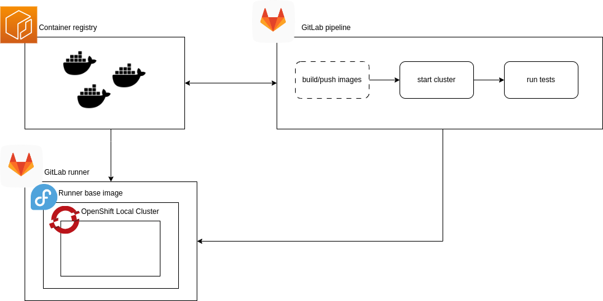

# OpenShift Local Cluster Integration Test Runner

[](https://github.com/marketplace/actions/super-linter)


This is an open source project that enables users to run integration tests against an OpenShift local cluster in their GitLab CI pipelines. The integration tests are written in any language and framework, and this tool provides an easy way to set up and tear down a local cluster for testing.

OpenPipe aims to shift left integration tests by eliminating the operational overhead a full-on dev cluster brings with it.

If you're looking for a more lightweight, but less production-like solution that mocks the OpenShift API, check out [static KAS](https://github.com/alvaroaleman/static-kas).

## Documentation

- [Requirements](#minimal-requirements)
- [Configuration](#configuration)
- [Limitations](#limitations--pitfalls)
- [License](#license)
- [Contributing](#contributing)

---

- [Quickstart](docs/examples/README.md)
- [Container Images](docs/container-images/README.md)
- [GitLab Runner](docs/gitlab-runner/README.md)



<figcaption>Highlevel overview diagram of how OpenPipe works.</figcaption>

## Minimal requirements

- image registry credentials
- gitlab runner with connectivity to your image registry
- gitlab runner with virutalization enabled in host system BIOS
- gitlab runner with [privileged mode enabled](https://docs.gitlab.com/runner/executors/docker.html#privileged-mode) (sandboxed containers recommended for workload isolation for runners on Kubernetes clusters)
- gitlab runner with at least 9216MiB of free memory, 35GiB disk, 4 CPU cores (this is the minimum for the base cluster to run. extensve custom configuration, and resource intensive deployments will require more resources)
- if your gitlab runner host system uses SELinux and you want to run containers with systemd you have set the container_manage_cgroup boolean variable: `setsebool -P container_manage_cgroup 1`
- a pull secret from the [Red Hat console](https://console.redhat.com/openshift/create/local)

## Optional

- gitlab runner with connectivity to [developers.redhat.com](https://developers.redhat.com) (to build openshift local containter images from source)

## Configuration

[openpipe container images](https://quay.io/repository/openpipe/oc-local-runner?tab=tags)

### Local Setup

<!-- The following environment variables can be used to configure the integration test runner: -->

### Cloud Deployment (crc-cloud)

OpenPipe supports running OpenShift Local on various cloud providers (AWS, GCP, OpenStack) using crc-cloud. This enables you to run integration tests in cloud environments when local virtualization is not available or when you need more resources.

#### Supported Cloud Providers

- **AWS**: Supports importing images and creating instances in multiple regions
- **GCP**: Supports creating instances (manual image import required)
- **OpenStack**: Supports creating instances (manual image import required)

#### Basic Usage

1. Import an image (AWS only):

```bash
openpipe crc-cloud import \
    --project-name "my-project" \
    --backed-url "file:///workspace" \
    --output "/workspace" \
    --provider "aws"
```

2. Create an instance:

```bash
# AWS
openpipe crc-cloud create aws \
    --project-name "my-project" \
    --backed-url "file:///workspace" \
    --output "/workspace" \
    --aws-ami-id "ami-xxxx" \
    --pullsecret-filepath "/workspace/pullsecret" \
    --key-filepath "/workspace/id_ecdsa"

# GCP
openpipe crc-cloud create gcp \
    --project-name "my-project" \
    --backed-url "file:///workspace" \
    --output "/workspace" \
    --gcp-image-id "image-xxxx" \
    --pullsecret-filepath "/workspace/pullsecret" \
    --key-filepath "/workspace/id_ecdsa"

# OpenStack
openpipe crc-cloud create openstack \
    --project-name "my-project" \
    --backed-url "file:///workspace" \
    --output "/workspace" \
    --image "openshift-local-4.14.3" \
    --network "provider_net" \
    --pullsecret-filepath "/workspace/pullsecret" \
    --key-filepath "/workspace/id_ecdsa"
```

3. Destroy resources:

```bash
openpipe crc-cloud destroy \
    --project-name "my-project" \
    --backed-url "file:///workspace" \
    --provider "aws|gcp|openstack"
```

#### Authentication

Each cloud provider requires specific environment variables for authentication:

- **AWS**:

  - `AWS_ACCESS_KEY_ID` and `AWS_SECRET_ACCESS_KEY`
  - `AWS_SESSION_TOKEN` (for temporary credentials)
  - `AWS_PROFILE` (for multiple profiles)

- **GCP**:

  - `GOOGLE_APPLICATION_CREDENTIALS`
  - `GCLOUD_PROJECT`
  - `GCLOUD_REGION`
  - `GCLOUD_ZONE`

- **OpenStack**:
  - `OS_CLIENT_CONFIG_FILE`
  - `OS_CLOUD`

For detailed usage and additional options, run:

```bash
openpipe crc-cloud --help
openpipe crc-cloud [command] --help
```

## Limitations & pitfalls

### Cluster

- The cluster uses the 172 address range. This can cause issues when, for example, a proxy is run in the same address space.
- The cluster runs in a virtual machine which may behave differently, particularly with external networking.
- The cluster uses a single node which behaves as both a control plane and worker node.
- Troubleshooting resources for OpenShift Local can be found [in the documentation](https://crc.dev/crc/#troubleshooting_gsg).

### GitLab runners

- Shared runners don't meet the resource requirements. Therefore, it is recommended to deploy dedicated runners with the appropriate resource requests. Cf. [gitlab docs](https://docs.gitlab.com/runner/executors/kubernetes.html#cpu-requests-and-limits)

## Contributing

Contributions are welcome! Please fork this repository and submit a pull request with your changes.

## License

This project is licensed under the MIT License.
