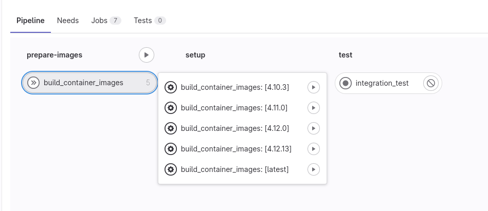

work in progress gitlab-ci pipeline that sets up openshift local in a gitlab runner to run integration tests against.

# OpenShift Local Cluster Integration Test Runner

This is an open source project that enables users to run integration tests against an OpenShift local cluster in their GitLab CI pipelines. The integration tests are written in any language and framework, and this tool provides an easy way to set up and tear down a local cluster for testing.

OpenPipe aims to shift left integration tests by eliminating the operational overhead a full-on dev cluster brings with it.

If you're looking for a more lightweight, but less production-like solution that mocks the OpenShift API, check out [project].

## Minimal requirements

- image registry credentials
- gitlab runner with connectivity to your image registry
- gitlab runner with virutalization enabled in host system BIOS
- gitlab runner with [privileged mode enabled](https://docs.gitlab.com/runner/executors/docker.html#privileged-mode) (sandboxed containers recommended for workload isolation for runners on Kubernetes clusters)
- gitlab runner with at least 9216MiB memory, 31GiB disk, 4 CPU cores (this is the minimum for the base cluster to run. extensve custom configuration, and resource intensive deployments will require more resources)
- if your gitlab runner host system uses SELinux and you want to run containers with systemd you have set the container_manage_cgroup boolean variable: `setsebool -P container_manage_cgroup 1`
- a pull secret from https://console.redhat.com/openshift/create/local

## Optional

- gitlab runner with connectivity to https://developers.redhat.com (to build openshift local containter images from source)

## Quickstart example

Create a `.gitlab-ci.yml` file in the root of your project.
Add the following job to your pipeline:

```
include: 'https://raw.githubusercontent.com/pfeifferj/openpipe/main/.gitlab-ci.yml'

integration_test:
  extends: setup_openshift_local
  script:
    - ./run-tests.sh
```

The pipeline should end up looking something like this:



Add any necessary environment variables or configuration files to the integration_test job.

### The minimal required variables are:

- `PULL_SECRET` # set this variable in your repository variables, mask, and protect it. the variable value is the contnet of the pull secret file you downloaded
- `REGISTRY_TOKRN` # token to pull from quay.io or your own registry

### Optional variables:

- `REGISTRY_URL` # to use your image registry
- `REGISTRY_USER` # robot username
- `REGISTRY_PASSWORD` # robot user password
- `RUNNER_TAG` # gitlab runner tag

Create a `run-tests.sh` script in the root of your project that runs your integration tests against the OpenShift cluster.

Push your changes to GitLab and watch the pipeline run the integration tests against the OpenShift local cluster.

<!-- ## Available variables -->

<!-- OpenShift credentials -->

## Configuration

https://quay.io/repository/openpipe/oc-local-runner?tab=tags

<!-- The following environment variables can be used to configure the integration test runner: -->

## Limitations & pitfalls

Shared runners don't meet the resource requirements. Therefore, it is recommended to deploy dedicated runners with the appropriate resource requests. Cf. [gitlab docs](https://docs.gitlab.com/runner/executors/kubernetes.html#cpu-requests-and-limits)

Alternatively, gitlab premium/ultimate subscribers have the option to use SaaS runners fo type `saas-linux-large-amd64` with 4 vCPUs, 16 GB RAM.

### Currently not supported:

- Multi node clusters (limitation of OpenShift Local)

### Planned

- Functionality to cache cluster configuration (basline .crc configs, maybe also custom configs built into custom testing images to reduce cold start time)
- Automatically map releases to OCP versions from https://github.com/crc-org/crc/releases

## Contributing

Contributions are welcome! Please fork this repository and submit a pull request with your changes.

## License

This project is licensed under the MIT License.
